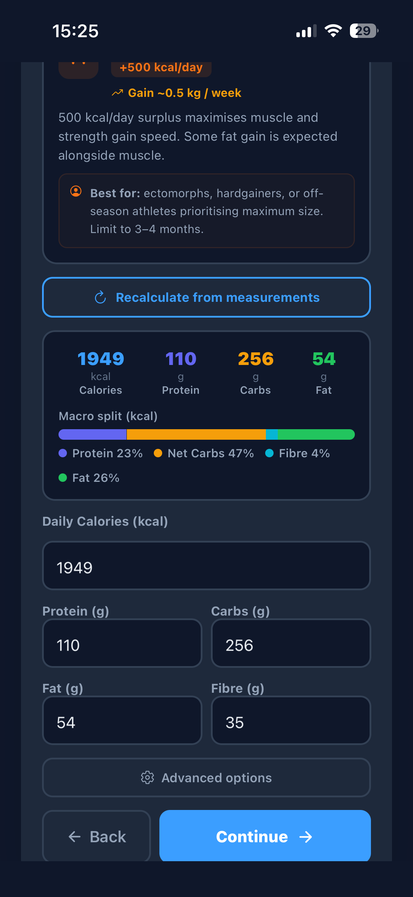
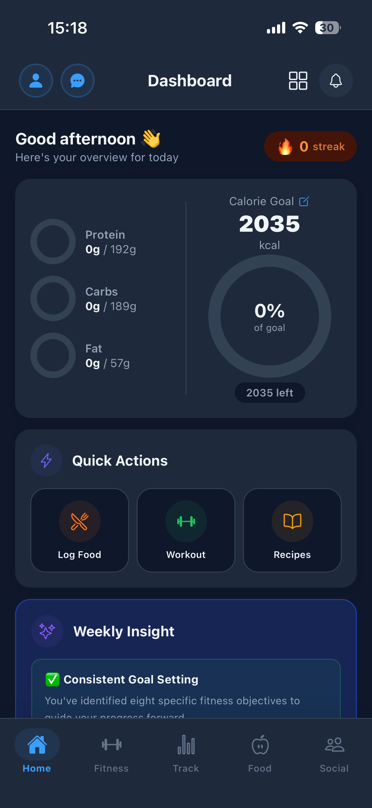
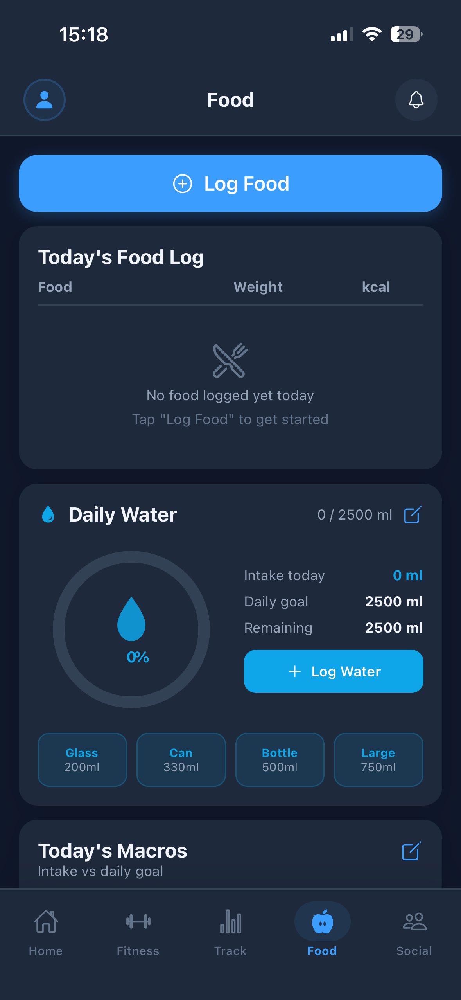
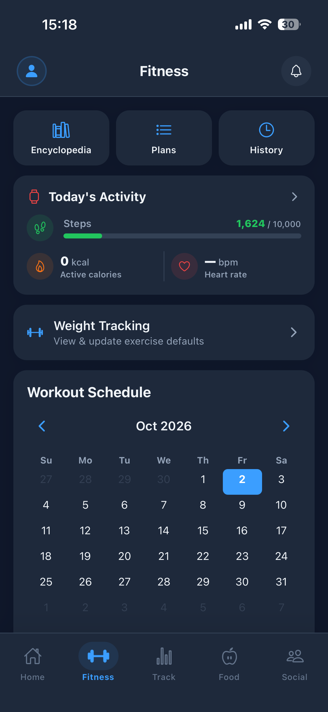
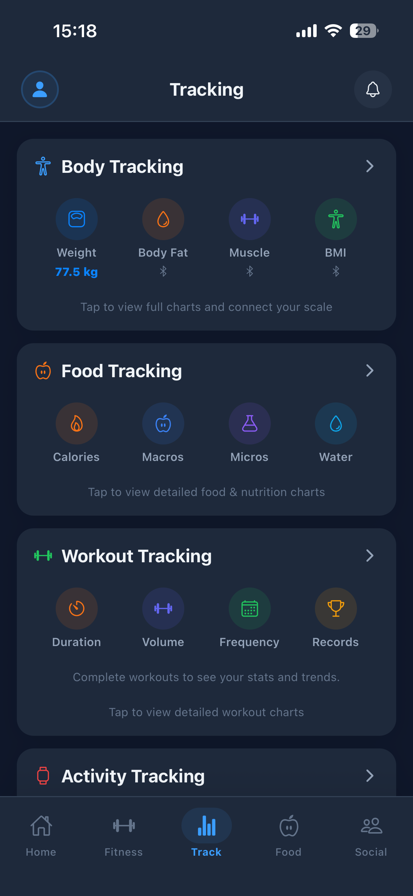
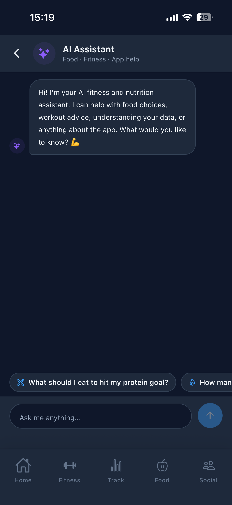

# SmartFoodFitness — Mobile App

A cross-platform food and fitness app built with React Native and Expo. Users can track meals, macros, workouts and body weight, and get AI-powered recommendations from Claude.

🖥️ Backend API: [smartfoodfitness](https://github.com/MustafaMalik21-dev/smartfoodfitness)

## 📱 Screenshots

  
  
  

  
  
  

## ✨ Features

- **Personalised onboarding** — users set their current weight and goals, which shape their targets across the app
- **Dashboard** — an at-a-glance daily summary of nutrition and training
- **Food logging** — search foods (powered by USDA FoodData Central) and track macros against daily targets
- **Workout tracking** — log workouts from an exercise library organised by muscle group
- **Progress tracking** — monitor weight and performance over time
- **AI recommendations** — personalised meal and workout suggestions generated by Claude via the backend

## 🛠️ Tech Stack

| Area | Technology |
|---|---|
| Framework | React Native, Expo |
| Language | JavaScript |
| Backend | Java Spring Boot REST API, PostgreSQL (hosted on Railway) |
| Auth | JWT |
| Distribution | EAS Build, TestFlight (iOS), Google Play |

## 🏗️ Architecture

The app communicates only with the SmartFoodFitness backend over REST. All third-party API keys, including the Claude key, are held server-side and never shipped in the app.

## 🚀 Running Locally

1. Clone the repo and install dependencies:
   npm install
2. Point the app's API base URL at a running instance of the backend
3. Start the development server:
   npx expo start
4. Open the app on a device or emulator using a development build

## 📚 What I Learned

- Converting a web app into a native mobile experience, including navigation, layouts and device testing
- Managing builds, versioning and App Store submission with EAS
- Designing a clean client–server split so sensitive keys stay on the backend
